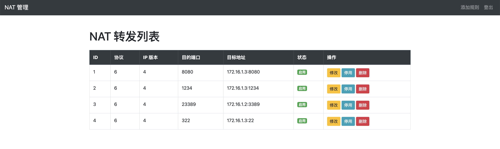
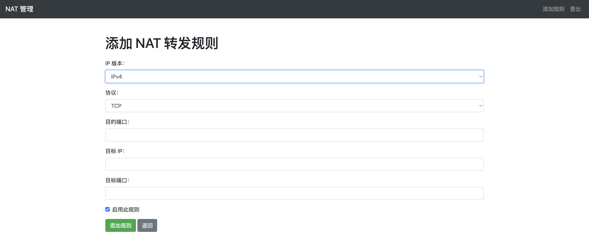

# Nat-Manager iptables简易端口转发管理系统

> 此系统主要应用于PVE(**Proxmox Virtual Environment**)单IP应用情况下，实现IPV4及IPV6端口转发





> [!NOTE]
>
> 默认账号及密码为：admin

**1. 确保系统已安装基础环境**

**更新系统**

当前以Debian12系统为例：

```shell
sudo apt update && sudo apt upgrade -y
```

**安装所需的软件包**

```shell
sudo apt install python3 python3-pip python3-venv build-essential libssl-dev libffi-dev -y
```

**2. 配置项目环境**

**进入项目目录**

```
cd nat_manager
```

**创建虚拟环境**

```shell
python3 -m venv venv
```

**激活虚拟环境**

```shell
source venv/bin/activate
```

**安装依赖项**

确认您的项目中有 requirements.txt 文件，运行：

```shell
pip install -r requirements.txt
```

如果没有，请手动安装必要的依赖项，例如：

```shell
pip install flask flask-login flask-sqlalchemy
```

**3. 运行项目（开发环境）**

直接运行 Flask 应用：

```shell
python3 app.py
```

**5. 部署到生产环境**

建议使用 WSGI（如 gunicorn）和反向代理（如 Nginx）部署。

**安装 Gunicorn**

```shell
pip install gunicorn
```

**使用 Gunicorn 启动项目**

```shell
gunicorn -w 4 -b 0.0.0.0:5000 app:app
```

**安装并配置 Nginx**

```shell
sudo apt install nginx -y
```

编辑 Nginx 配置文件：

```shell
sudo nano /etc/nginx/sites-available/my_project
```

内容示例：

```nginx
server {

  listen 80;

  server_name your_domain_or_ip;


  location / {

​    proxy_pass http://127.0.0.1:8000;

​    proxy_set_header Host $host;

​    proxy_set_header X-Real-IP $remote_addr;

​    proxy_set_header X-Forwarded-For $proxy_add_x_forwarded_for;

  }

}
```

启用配置并重启 Nginx：

```shell
sudo ln -s /etc/nginx/sites-available/my_project /etc/nginx/sites-enabled/

sudo systemctl restart nginx
```

**6. 设置开机启动（可选）**

**创建 Systemd 服务**

创建文件：

```shell
sudo nano /etc/systemd/system/nat_manager.service
```

内容示例：

```sh
[Unit]
Description=NAT Manager Service
After=network.target

[Service]
User=root
Group=root
WorkingDirectory=/root/nat_manager
Environment="PATH=/usr/local/sbin:/usr/local/bin:/usr/sbin:/usr/bin:/sbin:/bin"
ExecStart=/root/nat_manager/venv/bin/gunicorn -w 4 -b 0.0.0.0:5000 app:app

[Install]
WantedBy=multi-user.target
```

**启动并启用服务**

```shell
sudo systemctl start nat_manager

sudo systemctl enable nat_manager
```

